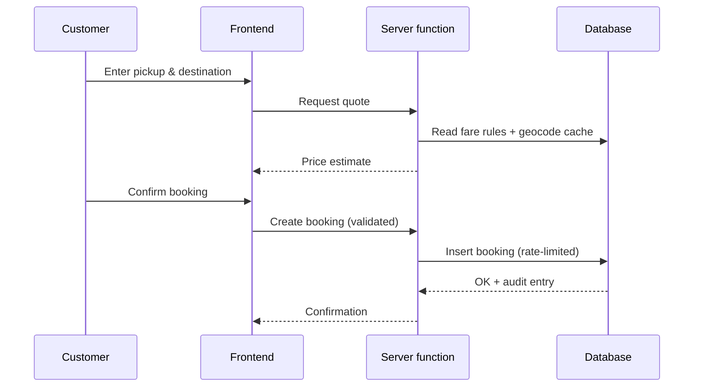

# Architecture

## Layers
| Layer | Technology | Responsibility |
|---|---|---|
| Frontend | React 19, TanStack Start, Tailwind CSS | Pages, booking UI, admin panel |
| Server logic | Server functions (edge runtime) | Validation, fare calculation, protected actions |
| Data | PostgreSQL (Supabase) | Bookings, drivers, vehicles, ratings, content |
| Auth | Supabase Auth | Sessions; roles kept in a separate table |
| Hosting | Edge deployment | Low latency, SSR for SEO |

## Booking flow

## Security model (conceptual)
- Row-level security on every table; customers see only their own bookings.
- Admin actions verified server-side through a role table, never client storage.
- Rate limiting on public write actions.
- Audit log for sensitive changes.
- Secrets stored in the platform vault, never in code.

## Design decisions
- **Geocode cache** reduces external API cost and latency.
- **Fare rules in data**, not code: prices change without deployments.
- **Site content table** lets the owner edit texts without a developer.
