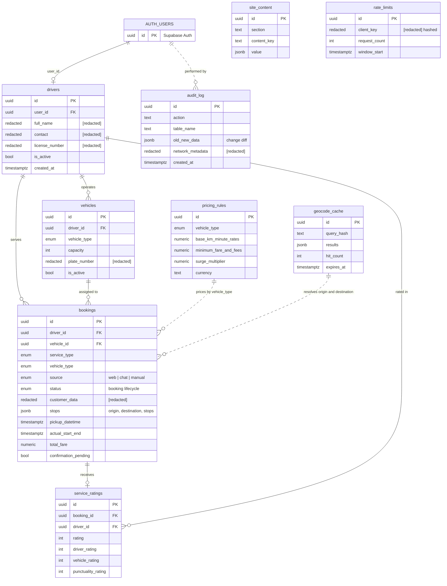

# Cabbie — Database Model

Supabase (PostgreSQL) data model of a ride-booking platform. Sanitized for public portfolio use.

## Entity-relationship diagram

## Design decisions

- **Native auth integration:** `drivers.user_id` and `audit_log` reference `auth.users.id`; access is enforced with Row Level Security (conceptual, policies not published).
- **Booking lifecycle:** `status` and `source` are enums, so invalid states cannot be stored.
- **Pricing by vehicle type:** `pricing_rules` is a logical lookup, not a foreign key, so rates can change without touching past bookings.
- **Geocoding cache:** `geocode_cache` stores hashed queries with expiry and hit counts to cut latency and third-party API cost.
- **Auditability:** `audit_log` keeps before/after diffs of sensitive changes.
- **Standalone tables:** `site_content` (CMS) and `rate_limits` are standalone tables with no FK dependencies.

## Omitted for confidentiality

Customer and driver personal data, plates, licence numbers, IP addresses, RLS policies, keys, endpoints and providers. `[redacted]` markers are intentional (privacy by design, GDPR-aware).
