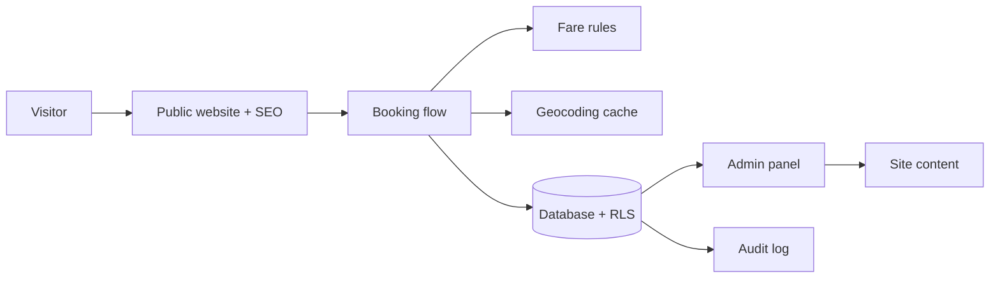

# Cabbie — Independent Product & Architecture Case Study

> Status: **in progress** · Sanitized: no credentials, customer data or production URLs.

A ride-booking platform for a private driver service: public website, booking flow, driver management, fare rules, content management and audit trail.

## Interactive diagrams

- [Operational flow (animated)](https://mattreyvit.github.io/cabbie-case-study/cabbie-flujo-operativo.html)
- [Data model (animated)](https://mattreyvit.github.io/cabbie-case-study/cabbie-modelo-datos.html)

## Problem
Small transport operators lose bookings to slow phone/WhatsApp flows and have no structured record of trips, ratings or pricing.

## Constraints
- Mobile-first, fast on 4G.
- Personal data handled under privacy-by-design principles.
- Content editable without developers.
- Low operating cost.

## Solution

## Documents
- [ARCHITECTURE.md](ARCHITECTURE.md) — layers, data flow and security model
- [DATABASE.md](DATABASE.md) — sanitized entity-relationship model
- [Interactive diagram](https://mattreyvit.github.io/cabbie-case-study/database-animated.html) *(GitHub Pages)*

## My role
Product definition, UX flows, data model, security policies, SEO and delivery — using AI-assisted development with a documented method ([reyvit-framework](https://github.com/MattReyvit/reyvit-framework)).

## Omitted for confidentiality
Client identity, real records, access policies' literal code, API keys, internal endpoints and production URLs.
