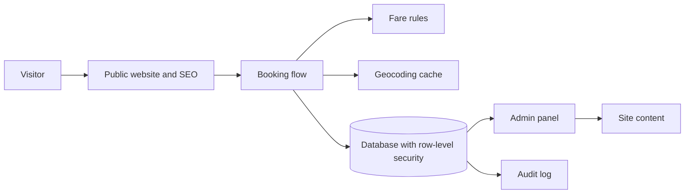
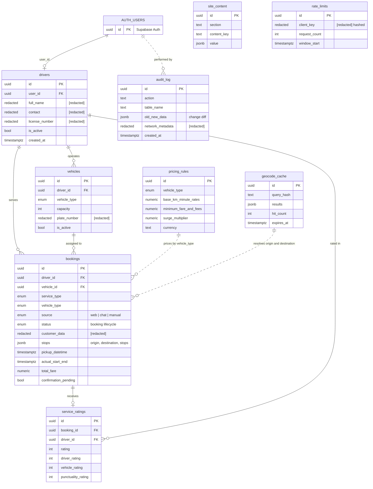

# Cabbie — Independent Product & Architecture Case Study

> Status: **in progress** · Sanitized architecture excerpt: no credentials, customer records or production URLs.

A ride-booking platform for a private driver service: public website, booking flow, driver management, fare rules, content management and audit trail.

## Interactive diagrams

[View both interactive diagrams on one page](https://reyvit-cisneros.github.io/cabbie-case-study/)

The page presents the operational flow first and the data model below it.

- [Operational flow — animated](https://reyvit-cisneros.github.io/cabbie-case-study/cabbie-flujo-operativo.html)
- [Data model — animated](https://reyvit-cisneros.github.io/cabbie-case-study/cabbie-modelo-datos.html)

## Operational overview

[Open the animated operational flow](https://reyvit-cisneros.github.io/cabbie-case-study/cabbie-flujo-operativo.html)

## Data model

Sanitized entity-relationship excerpt. Dashed relationships represent logical associations, not necessarily database foreign-key constraints. Redacted fields indicate omitted information, not actual database types.

[Open the animated data model](https://reyvit-cisneros.github.io/cabbie-case-study/cabbie-modelo-datos.html)

## Problem

Small transport operators lose bookings to slow phone/WhatsApp flows and have no structured record of trips, ratings or pricing.

## Constraints

- Mobile-first, fast on 4G.
- Personal data handled under privacy-by-design principles.
- Content editable without developers.
- Low operating cost.

## Solution

A connected booking workflow combining the public website, fare rules, geocoding cache, database access controls, administration, editable content and audit logging.

## Documents

- [ARCHITECTURE.md](ARCHITECTURE.md) — layers, data flow and security model.
- [DATABASE.md](DATABASE.md) — sanitized entity-relationship model.
- [Interactive diagrams](https://reyvit-cisneros.github.io/cabbie-case-study/) — operational flow and data model on one page.

## My role

Product definition, UX flows, data model, security policies, SEO and delivery — using AI-assisted development with a documented method ([Reyvit Framework](https://github.com/Reyvit-Cisneros/reyvit-framework)).

## Omitted for confidentiality

Client identity, real records, access policies' literal code, API keys, internal endpoints and production URLs.

## License

Documentation and diagrams: [CC BY 4.0](https://creativecommons.org/licenses/by/4.0/).
